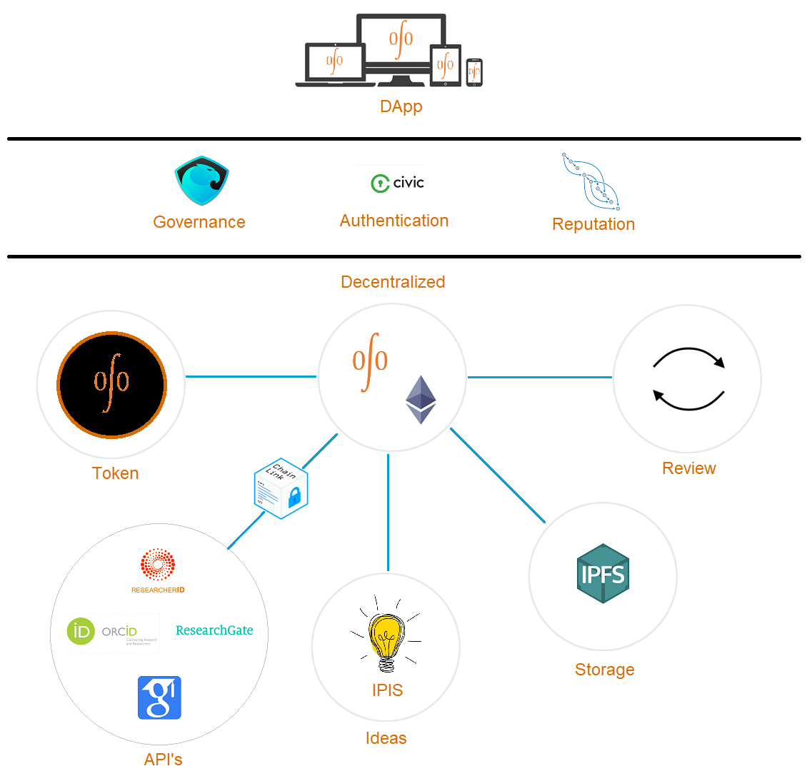
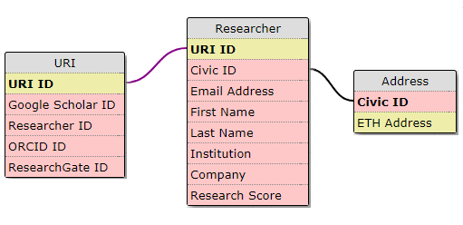

# URI

Unique Researcher Identity

## Problem

Fragmented solution to the problem of unique researcher identity (URI) proposed by multiple centralized organizations, examples include:
1. [Researcher ID](http://www.researcherid.com/)
2. [ORCID](https://orcid.org/)
3. [Google Scholar](https://scholar.google.com/)
4. [Researchgate](https://www.researchgate.net/)

## Solution

- Create a unique researcher identity (URI) that can be stored, tracked, shared, and audited by blockchain technology
- The URI can connect to the researcher's profile, research activities, references, and publications
- Connect URI with IPIS to implement the "[cost of idea](https://github.com/open-science-org/wiki/wiki/OSO-Whitepaper#cost-of-idea)"

## Approach

1. Encapsulate the researcher ID inside the Idea class of Interplanetary Idea System ([IPIS](https://github.com/open-science-org/IPIS))
  - This will be a roadmap feature as it is not feasible in the projects current state but is a goal as the project evolves

2. Use third party services for Identification/Authentication (i.e. Civic) and for data collection via blockchain oracles (i.e. LINK)
  - CIVIC or uPort can be used as a forma of authentication
  - LINK or Oraclize can be used to pull data from existing researcher identity platforms such ORCID, Google Scholar, etc. and tie them into the URI model

3. Hybrid approach
  - Combine the concept of IPIS and authenticator and oracle services from third party

## Network Diagram

To help visualize how these solutions can combine together to help build a research ecosystem the following diagram has been put together.

## Contract Design

To help visualize the URI design in code we are going through a Proof of Concept phase to accelerate the development process.  An initial design idea can be seen with the Solidity contracts found in this [repository](solidity).

Also, a high level Schema has been put together that will help serve as a goal for this Proof of Concept stage.

## References

1. http://www.jakobrdl.dk/blog/2015/02/why-orcid-and-researcherid-when-we-have-google-scholar
